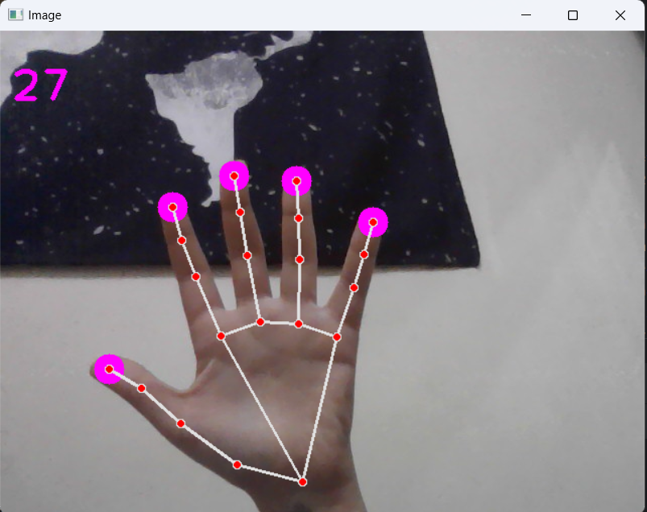

# 3D手部追踪、手势计数与距离估算

本项目基于 Python、OpenCV 和 Google 的 MediaPipe 库，实现了一个功能强大且实时的手部追踪系统。它不仅能够精准地识别手部的21个3D关节点，还能根据手指伸展状态进行计数，并利用计算机视觉原理估算手部与摄像头的物理距离。



---

## ✨核心功能

-   **实时3D手部关节点追踪**：以高帧率精准定位21个手部3D坐标。
-   **动态手势计数**：实时计算并显示伸出的手指数量。
-   **物理距离估算**：科学地估算手部到摄像头的直线距离（单位：厘米）。
-   **优雅的UI界面**：采用柔和的马卡龙配色方案，并为信息展示添加了对比背景，确保在任何环境下都清晰可读。
-   **性能监控**：在屏幕上实时显示帧率（FPS），便于性能评估。

---

## 🔧 Quick Start

1.  **环境配置**:
    确保已安装 Python 3.x。然后通过 pip 安装必要的库。项目根目录下已包含 `requirements.txt` 文件。
    ```bash
    pip install -r requirements.txt
    ```
    它会自动安装 `opencv-python`,`pygame` 和 `mediapipe`。

2.  **启动程序**:
    在项目根目录下运行以下命令：
    ```bash
    python hand_tracking_3d.py
    ```

3.  **退出程序**:
    在程序窗口激活的状态下，按 `q` 键即可退出。

## 🚀 工作原理


### 1. 手部追踪 (Hand Tracking)

手部追踪是整个系统的核心，我们借助 Google 强大的 **MediaPipe** 框架来实现。它并非一个简单的模型，而是一个由多个模型协同工作的复杂机器学习流水线（ML Pipeline）。

#### **追踪流程**

MediaPipe Hands 采用了一个巧妙的两阶段检测流程：

1.  **手掌检测 (Palm Detection)**：
    *   **作用**：首先，一个轻量级的、为移动端优化的`手掌检测模型`会在整个画面中快速寻找手掌。
    *   **优势**：为什么是检测手掌而非整只手？因为手掌的形状相对固定（像一个刚体），不像手指那样姿态万千，所以检测起来更稳定、更不容易受手指遮挡或握手等姿态的干扰。
    *   **输出**：该模型会输出一个框选出手掌的矩形区域。

2.  **手部关节点回归 (Hand Landmark Regression)**：
    *   **作用**：在第一步框选出的“手掌区域”内，一个更复杂的`手部关节点模型`会进行精细计算，直接预测出21个关节点的准确3D坐标。
    *   **优势**：由于模型只需关注一小块区域，而不是整张图像，因此它可以将全部“算力”用于提升关节点定位的精度，同时大幅降低了对图像旋转、缩放等数据增强的需求，性能和精度都得到了保证。

#### **模型接口封装: `HandDetector` 类**

为了让代码逻辑更清晰、更易用，我将 MediaPipe 的复杂调用封装在了 `hand_tracking_3d.py` 的 `HandDetector` 类中。

-   `__init__(...)`: 初始化函数，可以设置最大检测手数(`maxHands`)、检测置信度(`detectionCon`)等超参数。
-   `findHands(...)`: 负责接收图像，运行上述的追踪流程，并在图像上绘制出手骨骼连接线和关节点。
-   `findPosition(...)`: 负责从 MediaPipe 复杂的返回结果中，提取出我们需要的坐标数据，并整理成一个更简洁的列表。

#### **数据结构定义 (Data Packet Definition)**

`findPosition` 方法最终会输出一个名为 `lmList` 的列表，这是我们后续所有功能的数据基础。

-   `lmList` 是一个包含21个元素的列表，每个元素代表一个手部关节点。
-   每个元素本身也是一个列表，结构为 `[id, x, y, z]`：
    -   `id`: 关节点的ID（0到20），例如0是手腕，8是食指指尖。
    -   `x`, `y`: 该关节点在屏幕上的 **像素坐标**。
    -   `z`: 由MediaPipe提供的 **相对深度坐标**。**请注意：** 这个`z`值**不是**物理距离，其原点(0)在手腕处，数值越小代表该点离摄像头越近。它的尺度与`x`坐标大致相同，主要用于判断手部的立体形态，而非绝对距离。


### 2. 手势计数 (Finger Counting)

手势计数功能通过分析关节点的相对位置来实现，具体逻辑在 `fingersUp()` 方法中。

-   **大拇指的判断**：
    *   大拇指的开合是水平方向的。考虑到我们的摄像头画面是水平翻转的（为了符合镜面直觉），判断逻辑需要区分左右手。
    *   **右手**: 大拇指在左侧，当指尖(`id: 4`)的x坐标 **小于** 下一关节(`id: 3`)的x坐标时，视为伸出。
    *   **左手**: 大拇指在右侧，当指尖(`id: 4`)的x坐标 **大于** 下一关节(`id: 3`)的x坐标时，视为伸出。

-   **其他四指的判断**：
    *   食指、中指、无名指和小指的伸展是垂直方向的。逻辑比较简单：如果指尖（如食指`id: 8`）的y坐标 **小于** 指根下方的关节（如`id: 6`）的y坐标，就意味着指尖在关节的上方，即手指为伸出状态。

该方法最终返回一个包含5个0或1的列表（例如 `[1, 1, 0, 0, 0]` 代表大拇指和食指伸出），程序通过统计列表中`1`的数量即可得到总伸指数。

### 3. 距离检测 (Distance Estimation)

正如前面所分析的，MediaPipe返回的`z`坐标无法直接用于测量物理距离。为此，我们采用了一个基于计算机视觉中**透视投影**原理的更科学的方法。

#### **核心原理**

一个固定物理尺寸的物体，离摄像头越远，其在画面中呈现的像素尺寸就越小；反之，离得越近，像素尺寸就越大。它们的像素尺寸与真实距离成**反比**关系。

#### **实现步骤**

1.  **选取参照物**：我们在手上选取了两个在大部分手势下物理距离相对恒定的关节点作为“参照物”：**手腕 (id: 0)** 和 **中指根部 (id: 9)**。
2.  **计算像素距离**：在每一帧图像中，我们使用 `math.hypot`（欧几里得范数）来计算这两个点在2D屏幕上的像素距离 `pixel_dist`。
3.  **应用反比公式**：通过一个简单的标定，我们可以用以下公式估算出真实距离：
    ```
    真实距离 = (参考像素距离 * 参考真实距离) / 当前像素距离
    ```

#### **标定方法 (Calibration)**

为了让估算更准确，代码中内置了一组标定参数（`D_REF_CM` 和 `PIX_DIST_REF`）。可以按照代码注释中的步骤进行一次性标定，以适配摄像头和使用场景，从而获得更精确的距离读数。

### 4. 补充功能 (My Additions)

1.  **美学与用户体验 (UI/UX)**：
    *   精心挑选了“马卡龙”色系，相比刺眼的亮色，视觉上更柔和、专业，长时间使用也不易疲劳。
    *   所有屏幕上的文本信息（手指数、距离、FPS）都带有纯黑色的背景板，确保了在任何杂乱的视频背景下都具有出色的可读性。

2.  **代码封装与可读性**：
    *   通过`HandDetector`类的设计，将所有与MediaPipe相关的复杂操作全部封装起来，使得主程序循环（`main`函数）的逻辑异常清晰、简洁，极大地提高了代码的可维护性和可读性。

---


